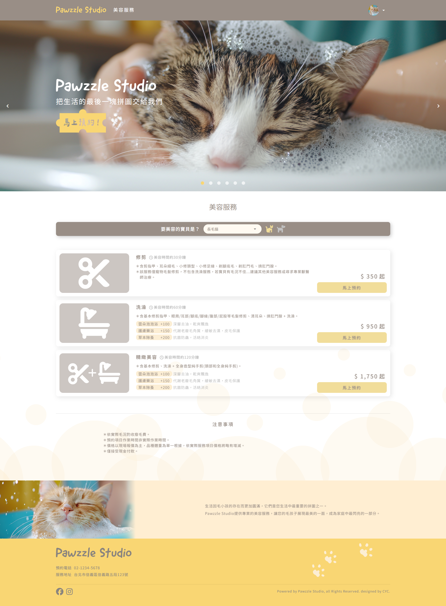
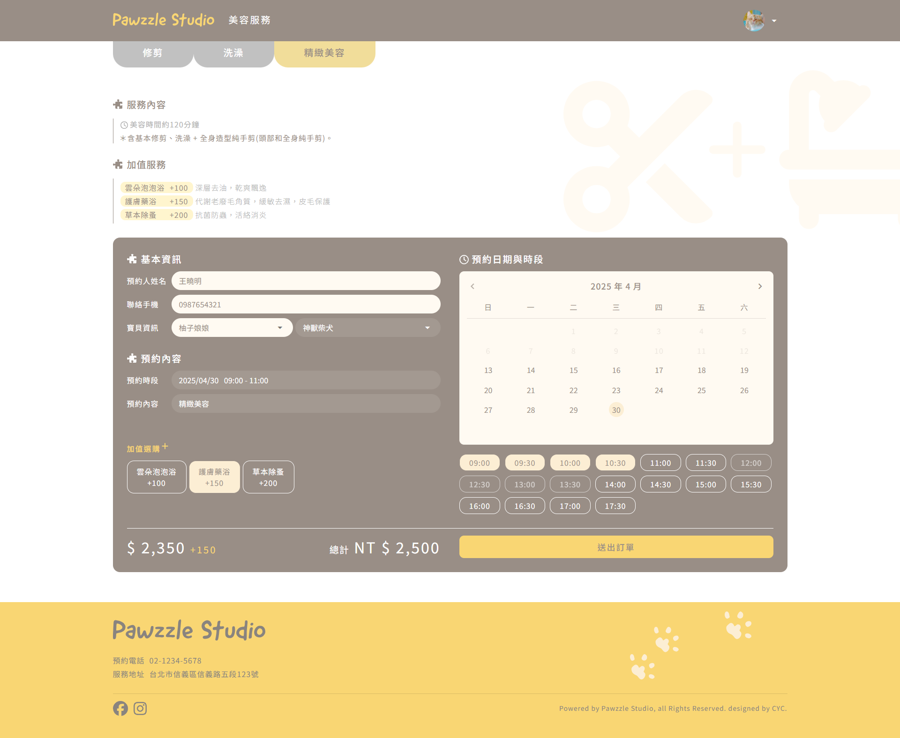

# Pawzzle 寵物美容預約平臺

線上網址：[https://pawzzle.zeabur.app/](https://pawzzle.zeabur.app/)

## 作品說明



Pawzzle是一個提供線上預約寵物美容服務的平台，使用者可在首頁瀏覽並選擇合適的方案，接著於預約頁填寫基本資訊與日期，即可完成預約流程。<br>
平臺支援 Google 第三方登入，使用者可快速以 Google 帳號登入，提升操作便利性與安全性。<br>
會員登入後，可查看歷次預約紀錄及取消功能，並可編輯個人資料與管理寵物清單。

## 系統說明
Node: 建議 20 以上。
### Setup
Make sure to install dependencies:
```bash
# npm
npm install

# pnpm
pnpm install

# yarn
yarn install

# bun
bun install
```

### Development Server
Start the development server on `http://localhost:3000`:
```bash
# npm
npm run dev

# pnpm
pnpm dev

# yarn
yarn dev

# bun
bun run dev
```

### Production
Build the application for production:
```bash
# npm
npm run build

# pnpm
pnpm build

# yarn
yarn build

# bun
bun run build
```
Locally preview production build:
```bash
# npm
npm run preview

# pnpm
pnpm preview

# yarn
yarn preview

# bun
bun run preview
```

## 檔案結構
```txt
Pawzzle
├─ assets            // CSS檔案、icons
├─ components        // Vue元件
├─ composables       // 自定義的 Composition API 函式(如：useFetchApi)
├─ layouts           // 頁面佈局
├─ middleware        // 中介層邏輯(頁面存取權限控管)
├─ pages             // 路由頁面
├─ plugins           // 自定義插件(如api)
├─ public            // 靜態資源，圖片等
├─ stores            // Pinia 狀態管理
├─ utils             // 通用工具函式
├─ .env.example      
├─ .gitignore         
├─ app.vue           // 頁面主入口
├─ error.vue         // 自定義錯誤頁面元件
├─ nuxt.config.ts    
├─ package-lock.json
├─ package.json
└─ tsconfig.json
```
## 使用技術
- [Nuxt 3](https://nuxt.com/)
- [TypeScript](https://www.typescriptlang.org/)
- [Pinia](https://pinia.vuejs.org/)
- [Quasar Framework](https://quasar.dev/)
- [nuxt-icons](https://nuxt.com/modules/icons)
- [nuxt-aos](https://nuxt.com/modules/aos)
- [vee-validate + yup](https://vee-validate.logaretm.com/v4/)
- [dayjs](https://day.js.org/)
- [eslint](https://eslint.org/)
- 第三方google登入  
  採用 [Google Identity Services（GIS）](https://developers.google.com/identity)實作第三方登入，支援彈跳視窗、One Tap 與自動登入等多種流暢體驗。整合 [FEDCM](https://developer.mozilla.org/en-US/docs/Web/API/FedCM_API) 技術，無需額外套件，即可實現更安全、直覺的登入流程，並符合最新隱私標準。

### Google 第三方登入：傳統與新版流程及技術差異對照表
| 項目       | 傳統舊版登入（OAuth Redirect） | 新版登入（Google Identity Services, GIS）                               |
|------------|----------------------|-------------------------------------------------------------------------|
| 流程形式   | 整頁跳轉（redirect）       | 彈跳視窗（popup）、One Tap、自動帳號選擇提示，無需整頁跳轉               |
| 使用者體驗 | 流程較長，中斷感明顯           | 流程流暢快速，使用體驗更佳                                               |
| 技術依賴   | 需前後端協調授權碼交換與 token 管理 | 前端可直接取得 ID token（JWT），後端只需驗證 ID token 即可，大幅簡化流程                                  |
| 套件依賴   | 使用第三方套件（如 vue3-google-login）或自行實作         | 使用官方 SDK，無需額外套件                                               |
| 安全性     | 依賴後端授權碼交換流程          | 整合 FEDCM（Federated Credential Management）技術，提升安全性          |
| UX 模式    | 固定 redirect          | 可切換 popup 或 redirect，依需求調整（GIS 預設鼓勵 popup / One Tap）    |
| 更新與維護 | 依賴第三方套件更新            | 直接使用 Google 官方 SDK，更易維護並能快速跟進新功能                    |

## 參考資料
- [Custom useFetch in Nuxt](https://nuxt.com/docs/guide/recipes/custom-usefetch)
- [You are using useFetch WRONG! (I hope you don't)](https://www.youtube.com/watch?v=njsGVmcWviY)
- [The BEST way to proxy your API in Nuxt](https://www.youtube.com/watch?v=J4E5uYz5AY8)
- [Custom $fetch and Repository Pattern in Nuxt 3](https://www.youtube.com/watch?v=jXH8Tr-exhI)
- [Google Identity](https://developers.google.com/identity?hl=zh-cn)
- [快速掌握 2023 新版 Google 登入 API﹍完整教學及實作範例](https://ww.wfublog.com/2023/01/google-identity-sign-in-api.html)
- [Building a custom Google Sign-In button](https://developers.google.com/identity/sign-in/web/build-button?hl=en)